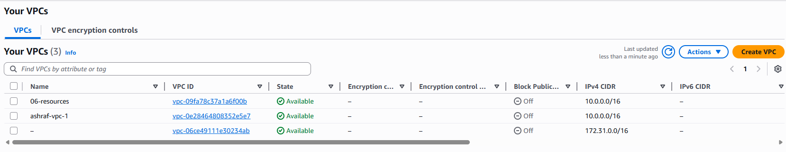
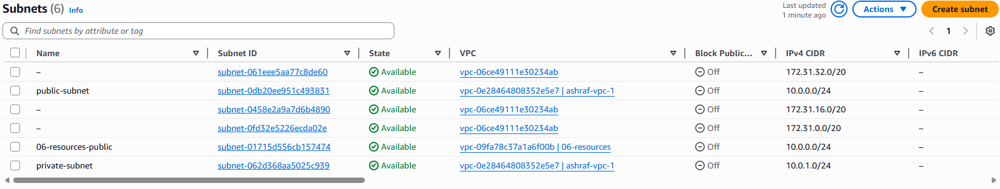

# Terraform NGINX Server Project (AWS)

This project provisions a custom VPC with a public subnet and launches an EC2 instance that serves NGINX using a prebuilt NGINX AMI (so no user_data install script is required in your current .tf files).


## 📁 Project Overview

- Define cloud provider and region
- Create VPC , Public Subnet , Internet Gateway , Route Table
- Create Security Group
- EC2 NGINX Server

## What This Project Creates

### provider.tf

- Defines the cloud provider (AWS)
- Terraform version ~> 1.7
- Configures AWS Region
- ap-southeast-1 (Singapore)

### networking.tf

- locals (common tags)
    - Defines local.common_tags used by all resources:
    - ManagedBy = "Terraform"
    - Project = "06-resources"
    - CostCenter = "1234"

- Create Amazon VPC

    - 10.0.0.0/16
    - Tagged as Name = "06-resources"

- Public Subnet

    - 10.0.0.0/24
    - Tagged as Name = "06-resources-public"

- Internet Gateway

    - Enables internet access for the VPC

- Public Route Table + Association

    - Route: 0.0.0.0/0 → Internet Gateway
    - Associated to the public subnet

### compute.tf

- EC2 Instance (NGINX AMI)
    - t3.micro
    - associate_public_ip_address = true
  
- Security Group (HTTP/HTTPS)
    - Allows inbound:
        - 80 (HTTP) from 0.0.0.0/0
        - 443 (HTTPS) from 0.0.0.0/0
          - Uses subnet + security group above


## AWS Console

### VPC 

<p align="center">
  
</p>

<p align="center">
  
</p>


### Subnet 

<p align="center">
  
</p>

<p align="center">
  
</p>


### Route Table

<p align="center">
  
</p>

<p align="center">
  
</p>

### Internet Gateway

<p align="center">
  
</p>

<p align="center">
  
</p>

### NGINX Server

<p align="center">
  
</p>

<p align="center">
  
</p>

<p align="center">
  
</p>

<p align="center">
  
</p>

## For UBUNTU AMI-ID 

- Please visit this website for the AMI-ID : https://cloud-images.ubuntu.com/locator/ec2/

- Replace the NGINX AMi-ID to deploy to UBUNTU Server


## Cleanup (Destroy Resources)

```bash 
terraform destroy 
```

## ✅ Key Learning Outcomes

Build AWS networking using Terraform (VPC, subnet, IGW, route table)

Understand what makes a subnet “public” (route + association)

Create security groups using ingress rule resources

Launch an EC2 instance inside a custom VPC

Use Terraform locals + tags (merge(local.common_tags, ...)) for clean governance

Standard Terraform workflow (fmt, init, validate, plan, apply, destroy)